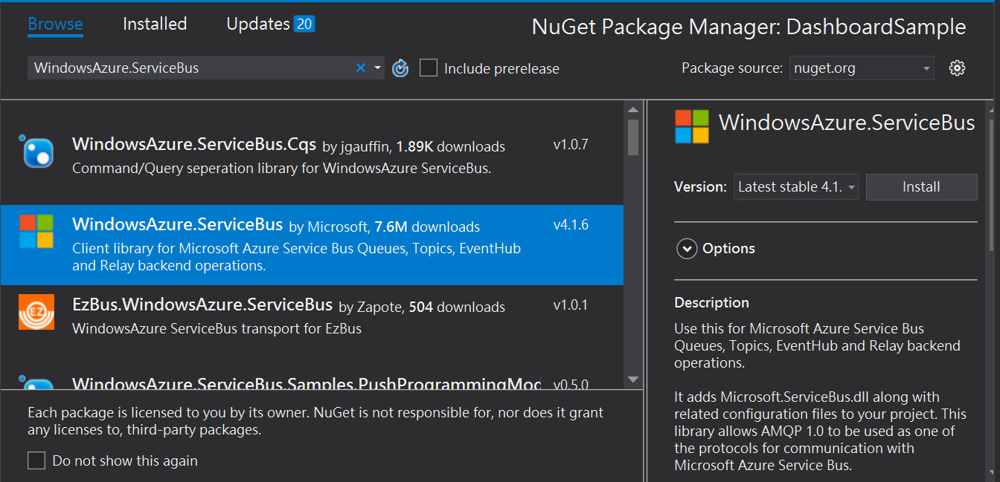
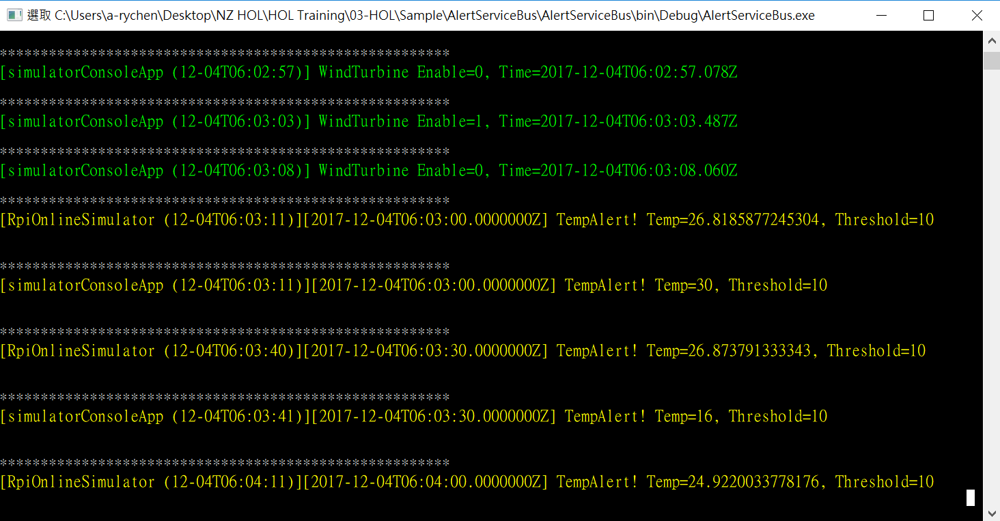
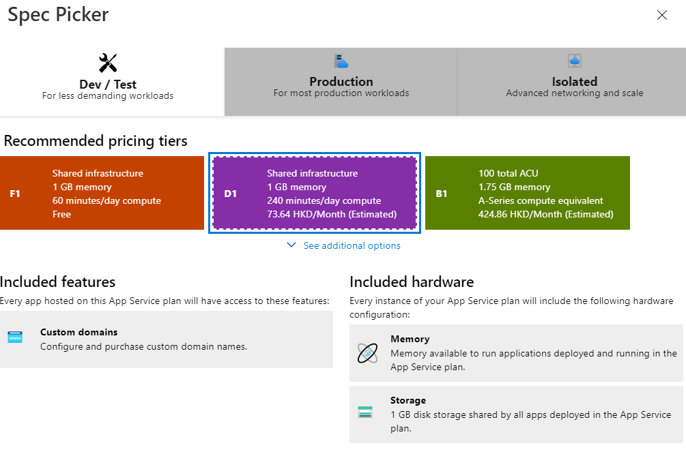
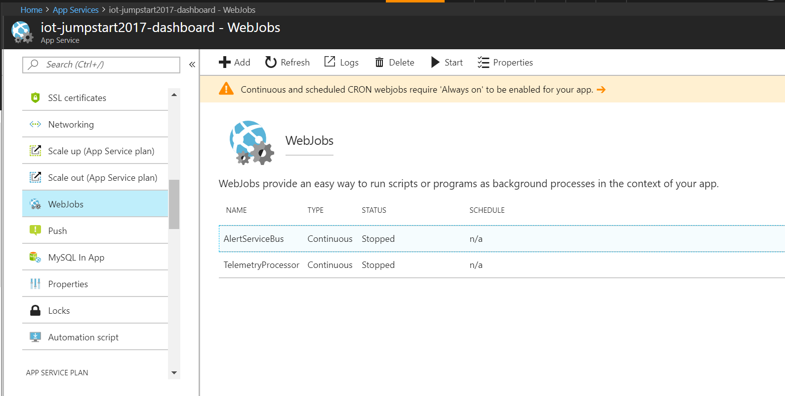

# IoT Jumpstart Workshop
Updated : July 2020

## Target audience
- IoT Device developers
- Application developers
- System integrators

## Abstract and learning objectives
***
Learn how to monitor your IoT devices and sensors remotely and perform insightful actions from streaming telemetry data with Microsoft Azure IoT solutions. This workshop takes you through the best practices in deploying an end-to-end IoT solution. You will learn about the tools, data analytics and where Azure IoT can take you and your organization moving forward.  

In this workshop, you will:

* Learn Azure IoT architectural design through 7 step-by-step hands-on lab exercises;
* Build a real-time remote monitoring web dashboard on Azure – from the device to cloud;
* Utilize streaming telemetry data captured by your devices to extract patterns based on SQL queries and setup rule-based alerts on demand.


## Overview
***
The IoT Jumpstart Hands-on-Lab is an exercise that will challenge you to implement an end-to-end scenario using Azure IoT Hub, Azure Stream Analytics jobs, Azure Storage Accounts, Service Bus and related Azure services. 

## Solution architecture
***


The solution begins with 2 **IoT Devices** which are responsible for reading device telemetry such as temperature and humidity, etc., simulated by **custom C\# simulators on Windows and Node.js simulators on online Raspberry Pi**. 

These 2 devices are then connected to **IoT Hub** that acts as a central message hub for bi-directional communication between your application or Web App and the devices it manages. 

**Stream Analytics** jobs is run queries to store historical telemetry data in **SQL Database** and to trigger custom alarm rules based on device rules JSON configuration file in **Blob Storage**. 

A **Service Bus** is then configured to send alarm messages in real time when Stream Analytics detects anomalies referenced by the stored device rules JSON file. 

In addition to visualize streaming telemetry data in real time with **Power BI**, a real time dashboard is developed using **.NET MVC**, with **SignalR** handling connection management and **Event Processor Host** ingesting telemetry data from the devices. Finally, the dashboard is published using **App Services** and the core modules are deployed as **Web Jobs** to run automatically in the background. 

## Requirements
***
- Visual Studio Code
- Visual Studio 2019
- Node.js
- Azure subscription
- Power BI subscription

## Contents
***
-  [Abstract and learning objectives](#abstract-and-learning-objectives)
- [Overview](#overview)
- [Solution architecture](#solution-architecture)
- [Requirements](#requirements)
- [Hands-on Lab](#hands-on-lab)
    - [Exercise 1: Connect Devices to IoT Hub](#exercise-1-connect-devices-to-iot-hub)
        - [Help references](#help-references)
        - [Task 1: Provision an Azure IoT Hub](#task-1-provision-an-azure-iot-hub)
        - [Task 2: Build the simulated device with C#](#task-2-build-the-simulated-device-with-C#)
        - [Task 3: Observe the data communication between Device-to-Cloud (D2C) and Cloud-to-Devices (C2D) via Azure IoT Tools](#task-3-observe-the-data-communication-between-Device-to-Cloud-(D2C)-and-Cloud-to-Devices-(C2D)-via-Azure-IoT-Tools)
        - [Task 4: Run the second simulator on Raspberry Pi Azure Online Simulator](#Task-4-Run-the-second-simulator-on-Raspberry-Pi-Azure-Online-Simulator)
    - [Exercise 2: Perform Historic Data Processing in Azure Stream Analytics](#Exercise-2:-Perform-Historic-Data-Processing-in-Azure-Stream-Analytics)
        - [Help references](#help-references-1)
        - [Task 1: Run the simulated devices](#task-1-run-the-simulated-devices)
        - [Task 2: Create Azure SQL Database for the historic data](#task-2-create-Azure-SQL-Database-for-the-historic-data)
        - [Task 3: Create a Blob for telemetry data](#Task-3-Create-a-Blob-for-telemetry-data)
        - [Task 4: Create a Stream Analytics Job for historic data (SQL DB and Blob)](#Task-4-Create-a-Stream-Analytics-Job-for-historic-data-(SQL-DB-and-Blob))
        - [Task 5: Watch the historic data in SQL DB and Blob Storage](#Task-5-Watch-the-historic-data-in-SQL-DB-and-Blob-Storage)
    - [Exercise 3: Cloud to Device Alarm with Service Bus](#Exercise-3:-Cloud-to-Device-Alarm-with-Service-Bus)
        - [Help references](#help-references-2)
        - [Task 1: Create and upload a device rule in Blob](#task-1-Create-and-upload-a-device-rule-in-Blob)
        - [Task 2: Create a Service Bus for Temperature Alert](#task-2-Create-a-Service-Bus-for-Temperature-Alert)
        - [Task 3: Create new consumer groups of IoT Hub](#task-3-Create-new-consumer-groups-of-IoT-Hub)
        - [Task 4: Create a Stream Analytics Job for Alarm Message](#task-4-Create-a-Stream-Analytics-Job-for-Alarm-Message)
        - [Task 5: Run the Alert Service Bus Console App and the simulated devices and observe the result of alert](#Task-5:-Run-the-Alert-Service-Bus-Console-App-the-simulated-devices-and-observe-the-result-of-alert)
    - [Exercise 4: Creating a Power BI Real-time Dashboard](#Exercise-4:-Creating-a-Power-BI-Real-time-Dashboard)
        - [Help references](#help-references-3)
        - [Task 1: Create Power BI streaming dataset](#task-1-Create-Power-BI-streaming-dataset)
        - [Task 2: Make a Power BI real-time dashboard](#task-2-Make-a-Power-BI-real-time-dashboard)
        - [Task 3: Build the Event Processor Host to push the telemetry data](#task-3-Build-the-Event-Processor-Host-to-push-the-telemetry-data)
    - [Exercise 5: Web App Customization And SignalR](#Exercise-5:-Web-App-Customization-And-SignalR)
        - [Help references](#help-references-4)
        - [Task 1: Create a .NET MVC project](#task-1-Create-a-.NET-MVC-project)
        - [Task 2: Customize Dashboard User Interface](#task-2-Customize-Dashboard-User-Interface)
        - [Task 3: Add the SignalR Library](#task-3-Add-the-SignalR-Library)
        - [Task 4: Update Event Processor Host to push the telemetry data](#task-4-Update-Event-Processor-Host-to-push-the-telemetry-data)
        - [Task 5: Update Alert Service Bus to push the alert message](#task-5-Update-Alert-Service-Bus-to-push-the-alert-message)
        - [Task 6: Show the real time data and alert in dashboard](#Task-6-Show-the-real-time-data-and-alert-in-dashboard)
    - [Exercise 6: Device Rules and Command Control in Web App](#Exercise-6:-Device-Rules-and-Command-Control-in-Web-App)
        - [Help references](#help-references-5)
        - [Task 1: Add the Setting Controller to communication between the Web Server and ajax of Client](#task-1-Add-the-Setting-Controller-to-communication-between-the-Web-Server-and-ajax-of-Client)
        - [Task 2: Run all applications](#task-2-run-all-applications)
    - [Exercise 7: Web App and WebJob Deployment](#Exercise-7:-Web-App-and-WebJob-Deployment)
        - [Help references](#help-references-6)
        - [Task 1: Provision an App Services on Azure](#Task-1:-Provision-an-App-Services-on-Azure)
        - [Task 2: Publish the DashboardSample Web App Sample on Internet](#Task-2:-Publish-the-DashboardSample-Web-App-Sample-on-Internet)
        - [Task 3: Publish the Alert Service Bus and Event Processor Host projects as Azure Webjob](#Task-3-Publish-the-Alert-Service-Bus-and-Event-Processor-Host-projects-as-Azure-Webjob)
        - [Task 4: Watch the log of WebJob in Azure Portal](#Task-4:-Watch-the-log-of-WebJob-in-Azure-Portal)
    

# Hands-on Lab

## Exercise 1: Connect Devices to IoT Hub
***

In this exercise, you will learn how to connect devices to **IoT Hub** through **Azure Iot Device SDK** by:
- Provisioning an **Iot Hub** in Azure Portal
- Building the simulated devices
- Observing the data communication between Device-to-Cloud(D2C) amd Cloud-to-Device(C2D) via Visual Studio Code extension

### Help references

|**Description**|    **Links**  |
|---------------|---------------|
|               |               |

### Task 1: Provision an Azure IoT Hub

1. Login https://portal.azure.com.

2. Search **IoT Hub** and create new one. 

    

    Here we select **S1 Standard** for this workshop.
    * **Create** a new resources group to manage your solution.
    * Select a location (service region), for example, **East Asia**.
    * Ensure under Size and scale > Scale tier and units > Pricing and scaling tier, S1: Standard tier is selected.
    * Leave other settings as it is.

    
    
    
    (It may take a few minutes to deploy IoT hub.)

1. Next, we need to get the connection string of IoT Hub.

    * Navigate to your IoT Hub.
    * Select the **Shared access policies**, then choose the policy **iothubowner**.
    * Copy the **Connection string - primary key**.
    
        
    
    * Save the connection string for later use.

### Task 2: Build the simulated device with C#

1. In this IoT Hub, **create** the first simulated device, and name it to **CSharpSimulator**.

    
    Created successfully.
    
    
    
    * When the list was updated, we **select** the **CSharpSimulator** and copy **Primary Connection String** of the device.

        
    
    * Save the connection strong for later use.

1. Create the second device for **RpiOnlineSimulator**.

    
    * Copy the **Primary Connection String** of the device and save it for later use.
    
        

1. Build the C# simulated device.

    * Copy and extract the simulated device of C# project (**SimulatedDevice.zip**) to the Projects of Visual Studio.
    
        > Path: **C:\Users\<username>\Documents\Visual Studio 2019\Projects**

    * Open the **SimulatedDevice** solution (.sln file) of VS.

    * Build the C# simulator.
        * Right-click to build the project to restore all NuGet packages.
        
            
            
        
        * Paste the device connection string into the value of **IoTDevice.ConnectionString** in **App.config** file.
            
            
            
        
        * Open the **Program.cs** and add the following code in line 17 to load the connection string from AppSettings.
            ```
            string deviceConnectionString = ConfigurationManager.AppSettings["IoTDevice.ConnectionString"];
            ```
            

        * Add the global variables in Program class.
            ```
            private static DeviceClient _deviceClient;
            private static bool _isStopped = false;
            private static string _deviceName;
            ```
            
        
        * Create a DeviceClient instance from Azure IoT Hub C# SDK.
            ```
            _deviceClient = DeviceClient.CreateFromConnectionString(deviceConnectionString, TransportType.Amqp);
            ```
            
        
        * Implement the **sendMessageToCloudAsync** method. 
        
            First, please fill the telemetry data format in telemetryDataPoint.
            ```
            var telemetryDataPoint = new
                                {
                                    deviceId = _deviceName,
                                    msgId = "message id " + i,
                                    temperature = currentTemperature,
                                    humidity = currentHumidity,
                                    time = DateTime.UtcNow.ToString("yyyy-MM-ddTHH:mm:ss.fffZ") // ISO8601 format, https://zh.wikipedia.org/wiki/ISO_8601
                                };
            ```
            
        
        * Use **SendEventAsync method to send message to IoT Hub.
            ```
            await _deviceClient.SendEventAsync(message);
            ```
            
        
        * Use **ReceiveAsync** method to receive Cloud-to-Device message from IoT Hub.
            ```
            Message receivedMessage = await _deviceClient.ReceiveAsync();
            if (receivedMessage == null) continue;// It returns null after a specifiable timeout period (in this case, the default of one minute is used)
            ```
            
        
        * Implement **processCommand method** to process C2D command.
            ```
            private static void processCommand(C2DCommand c2dCommand)
                {
                    switch (c2dCommand.command)
                    {
                        case C2DCommand.COMMAND_TEMPERATURE_ALERT:
                            displayReceivedCommand(c2dCommand, ConsoleColor.Yellow);
                            break;
                        case C2DCommand.COMMAND_TURN_ONOFF:
                            displayReceivedCommand(c2dCommand, ConsoleColor.Green);
                            _isStopped = c2dCommand.value.Equals("0"); // 0 means turn the machine off, otherwise is turning on.
                            break;
                        default:
                            Console.WriteLine("IT IS NOT A SUPPORTED COMMAND!");
                            break;
                    }

                }
            ```
            
        * 
        Complete te C2D message to IoT Hub.
            ```
            await _deviceClient.CompleteAsync(receivedMessage);
            ```
            
        
        * Let's press the **F5** to start debuggine and check the output of console
        
            

### Task 3: Observe the data communication between Device-to-Cloud (D2C) and Cloud-to-Devices (C2D) via Azure IoT Tools

1. In Visual Studio Code, login to your Azure account
1. Enable Azure IoT Hub Extension

     
     

1. Right click CSharpSimulator and click ‘Start Monitoring Built-in Event Endpoint
    
     

    Note: The data fields include the **deviceId, msgId, temperature, humidity and time**. We also set a property for **sensorType** as **thermometer** for the later data processing.

    You can use the following commands (JSON string) for testing. 
    (see the c2d-command.txt under Scripts folder)
    ```
    {"command": "TURN_ONOFF", "value":"1", "time":"2017-11-29T10:10:10.123Z"}
    or
    {"command": "TURN_ONOFF", "value":"0", "time":"2017-11-29T10:10:10.123Z"}
    or
    {"command": "TEMPERATURE_ALERT", "value":"50", "time":"2017-11-29T10:10:10.123Z"}
    ```
    
      
     
1. The output of Windows Console App

     

### Task 4: Run the second simulator on Raspberry Pi Azure Online Simulator
1. Open this website on your browser:
https://azure-samples.github.io/raspberry-pi-web-simulator/.

     

2. Finish the tutorial, then you can start to write your Node.js code here.

     
 

3. Coding now!
    *	Put your device connection string in line 15.
    
         
 
    * Change the telemetry data format
        ```
        function getMessage(cb) {
            messageId++;
            sensor.readSensorData()
                .then(function (data) {
                    cb(JSON.stringify({
                        deviceId: getDeviceId(connectionString),
                        msgId: 'message id ' + messageId,
                        temperature: data.temperature_C,
                        humidity: data.humidity,
                        time: getUTCTime()

                    }));
                })
                .catch(function (err) {
                    console.error('Failed to read out sensor data: ' + err);
                });
        }
        ```
         

    * Add the **getDeviceId** and **getUTCTime** functions
        ```
        function getDeviceId(cs) {
            var fields = cs.split(';');
            return fields[1].substring(fields[1].indexOf('=') + 1);
        }

        function getUTCTime() {
            return new Date().toISOString().
                replace(/\..+/, '') + "Z";     // delete the dot and everything after
        }
        ```
         

    * Replace the **getMessage** function for **SensorType** property.
        ```
        getMessage(function (content) {
                var message = new Message(content);
                message.properties.add('SensorType', 'thermometer');
                console.log('Sending message: ' + content);

                client.sendEvent(message, function (err) {
                    if (err) {
                        console.error('Failed to send message to Azure IoT Hub');
                    } else {
                        blinkLED();
                        console.log('Message sent to Azure IoT Hub');
                    }
                });
            });
        ```
         

    * Add a function call for processing the C2D message.
        ```
        processC2DMsg(message);
        ```
         
 

    * Implement the processC2DMsg function.
        ```
        function processC2DMsg(message) {
            try {
                var c2dMsg = JSON.parse(message);

                if (c2dMsg.command !== null) {
                    switch (c2dMsg.command) {
                        case 'TEMPERATURE_ALERT':
                            console.log(c2dMsg.time + '>>>>> TEMPERATURE_ALERT: ' + c2dMsg.value);
                            break;
                        case 'TURN_ONOFF':
                            console.log(c2dMsg.time + '>>>>> TURN_ONOFF: ' + c2dMsg.value);
                            if (c2dMsg.value === '0')
                                sendingMessage = false;// TURN OFF
                            else
                                sendingMessage = true;// TURN ON
                            break;
                        default:
                            printReceiveMessage(message);
                            break;
                    }
                }
                else
                    printReceiveMessage(message);
            }
            catch (e) {
                printReceiveMessage(message);
            }
        }
        ```
         

    * The last one step. Add the printReceiveMessage function to show the C2D messages.
        ```
        function printReceiveMessage(msg) {
            console.log('>>>>> Receive message: ' + msg);
        }
        ```
         

1. Done. Let’s start to run it. (You can set interval to 5000 ms if your IoT Hub is free tier)
    
     

    * Sending the D2C message every 2 seconds.
     

    * Monitor the D2C messages in Visual Studio Code.

         

    * You can use the same C2D commands as above to test the Device-to-Cloud (C2D) messages.
    (see the c2d-command.txt under Scripts folder)
        ```
        {"command": "TURN_ONOFF", "value":"1", "time":"2017-11-29T10:10:10.123Z"}
        or
        {"command": "TURN_ONOFF", "value":"0", "time":"2017-11-29T10:10:10.123Z"}
        or
        {"command": "TEMPERATURE_ALERT", "value":"50", "time":"2017-11-29T10:10:10.123Z"}
        ```
         
        
        


## Exercise 2: Perform Historic Data Processing in Azure Stream Analytics
***

In this exercise, you will learn how to perform historic data processing in Stream Analytics by:
- Creating an **Azure SQL Database** for historic data
- Creating a **Storage Account** for Blob
- Provisioning an **Azure Stream Analytics Job** for the historic data processing
    - **Input**
        - IoT Hub
    - **Output**
        - Azure SQL Database
        - Blob

### Help references

|**Description**|    **Links**  |
|---------------|---------------|
|               |               |

### Task 1: Run the simulated devices

1.	Run the executable file (SimulatedDevice.exe) or press F5 to debug in the Visual Studio. The executable file should be located at 
    > C:\Users\<username>\Documents\Visual Studio 2019\Projects\SimulatedDevice\SimulatedDevice\bin\Debug

    

2. Run your code on [Raspberry Pi Azure Online Simulator](https://azure-samples.github.io/raspberry-pi-web-simulator/).


### Task 2: Create Azure SQL Database for the historic data

1.	Login Azure Portal https://portal.azure.com

1. 	Search the **SQL Database**.

    

1.	Create the SQL Database
    *	Database name: **telemetrydb (it must be fixed in this workshop)**
    * Select the same resource group
    * Create new server
        * Server name: iotworkshop112101 (URL unique, for example)
        * Server admin login: dbadmin (for example)
        * Password: demo1234567! (for example)
        * Location: East Asia

            
    * Pricing Tier: **Basic** (Configure this in compute + storage) 
   
        
    * **Allow Azure services and resources to access this resource**
    
        
 

    * Wait for a few minutes to deploy it, then you can find the SQL Server and SQL database in your resource group.
 
1. Create the schema of database
    * Login your azure account in **Visual Studio**
    
        
    
    * Find your Azure SQL Database in **Server Explorer**.
    
        
    
    * Right click the **telemetrydb** to open **SQL Server Object Explorer** (or open it from View of the top toolbar)
        * Server Name: iotworkshop112101 (for example)
        * Database admin & password: **as your previous configurations**
        * Database Name: **telemetrydb**
    
            

    * Create new firewall rule
        * From **0.0.0.0** to **255.255.255.255** (demo purpose)

            
 

    * **New Query** to create new schema

        
    
    * Paste the following scripts and execute it.
        ```
        CREATE SCHEMA [Prod]
        CREATE TABLE [Prod].[HistoricData]
        (
            [Id] INT IDENTITY (1, 1) NOT NULL,
            [DeviceId] NVARCHAR(128) NOT NULL,
            [MessageId] NVARCHAR(128) NOT NULL,
            [Temperature] FLOAT(10) NOT NULL,
            [Humidity] FLOAT(10) NOT NULL,
            [LocalTime] DATETIME DEFAULT (getdate()) NOT NULL,
            [EventEnqueuedUtcTime] DATETIME DEFAULT (getdate()) NOT NULL,
            [CreatedAt] DATETIME DEFAULT (getdate()) NOT NULL,
            PRIMARY KEY CLUSTERED ([Id] ASC)
        )
        ``` 
        
    
    * Confirm the result of execution.
        
        
 
    * Watch the schema we created
        ```
        Select * from prod.HistoricData
        ```
        
        

### Task 3: Create a Blob for telemetry data

1. Provision a Storage Account for Blob
    * Login Azure Portal https://portal.azure.com
    * Search the **Storage account** and create it.
    
        
    
    * Create storage account
        * Name: iotworkshop112102 (According to your preferences)
        * Account kind: **General purpose**
        * Use existing resource group
        
            
 
    * Create and wait for the deployment.
    * Navigate to Access keys of Storage account.
    * Get the connection string of Storage Account and save it for the later use.
    
        

### Task 4: Create a Stream Analytics Job for historic data (SQL DB and Blob)

1. Login Azure Portal https://portal.azure.com
1. Create a Stream Analytics Job
    * Add and search **Stream Analytics job**
 
    * **Create** a Stream Analytics Job

    * Create a new Job
        * Job name: HistoricDataJob (for example)
        * Choose a subscription
        * Choose a resource group (using the same resources group is preferred)

        
 
    * Add an **IoT Hub** as the **stream input**

        

        * Input alias: **iothub (must be fixed)**
        * The others should be set as below

            
 
    * Add a **SQL database** as the **output**

        
        
        * Output alias: **sqldb (must be fixed)**
        * Database: **telemetrydb**
        * Username & password: please input your name and password of SQL database (for example, dbadmin/demo1234567!)
        * Table: **prod.HistoricData (must be fixed and please check the filled string without any space)**

            
   
    * Add a Blob Storage as the output
        * Output alias: **blob (must be fixed)**
        * Storage account: the same as the previous storage account
        * Container: **telemetry (We need to create a new one for it)**
        * Path pattern: **{date}/{time} (must be fixed)**
        * Date format: **YYYY-MM-DD (must be fixed)**
        * Time format: **HH (must be fixed)**
        * Format: **Array** (it’s easy to read the JSON array)
        * The others should be set as below

        
        
 
    * Add a **Query** for the historic data

        

        * Paste the following scripts into the query of Stream Analytics.
            ```
            WITH HistoricData AS (
                SELECT
                    Stream.[deviceId] AS [DeviceId],
                    Stream.[msgId] AS [MessageId],
                    Stream.[temperature] AS [Temperature],
                    Stream.[humidity] AS [Humidity],
                    Stream.[time] AS [LocalTime],
                    Stream.[EventEnqueuedUtcTime] AS [EventEnqueuedUtcTime]
                FROM 
                    [iothub] Stream
                WHERE GetMetadataPropertyValue(Stream, '[User].[SensorType]') = 'thermometer'
            )

            SELECT * INTO [blob] FROM HistoricData
            SELECT * INTO [sqldb] FROM HistoricData
            ``` 
        * And **Save**

            
 
    * Start now

        
    
        We need a few minutes to start Streaming Job…

### Task 5: Watch the historic data in SQL DB and Blob Storage

1. Create a **New Query** from the **telemetrydb** database in Visual Studio.
    
    ```
    Select * from prod.HistoricData
    ```
    
        
 
1. Navigate to Blobs of storage account.
1. Select the Blob file of telemetry container.

    

1. Download the blob 
    * View the content of blob 
    
        


## Exercise 3: Cloud to Device Alarm with Service Bus
***

In this exercise, you will learn how to send the alarm message from Cloud to Device in Stream Analytics by:
- Creating and uploading a device rule in Blob
- Creating a **Queue** of **Service Bus** on Azure
- Implementing a **Receiver** of Service Bus
    - Receive the alarm message
    - Send the Cloud to Device command
- Provisioning an **Azure Stream Analytics Job** for the alarm rules processing
    - **Input**
        - IoT Hub (from another consumer group of IoT Hub)
        - Rules Blob
    - **Output**
        - Azure Service Bus

### Help references

|**Description**|    **Links**  |
|---------------|---------------|
|               |               |

### Task 1: Create and upload a device rule in Blob

1. Build the Console App for Rules Blob
    * Copy the **RulesBlob.zip** from **03-HOL/Sample** folder to the projects of Visual Studio.
        >Path: C:\Users\<username>\Documents\Visual Studio 2017\Projects\
 
    * Unzip
    * Open the RuleBlob.sln file in Visual Studio.   
    * Open the App.config
    
        
    
    * Get the **Connection String** of **Storage Account** from the previous you wrote.
 
    * Update it into the value of StorageAccount.ConnectionString in App.config.
    
        

    * Press **F5** to build and debug the project 
    
    * Check the output of console
        
        
 
    * Download and open this Blob file. (Container: devicerules)
        
        
    
    * JSON Content
        
        
  
### Task 2: Create a Service Bus for Temperature Alert
1. Search and **Create** the **Service Bus** 
 
1. Create a namespace
    * Name: iotworkshop112102 (for example)
    * Pricing tier: **Basic**
    * Use the existing Resource Group.
    
        
 
1. Create a Queue
    * Name: temperatureAlert (must be fixed)
        
        
    
    * Get the connection string of Service Bus and save it for the later use.
    
        
 
 
### Task 3: Create new consumer groups of IoT Hub
1. Find your **IoT Hub**

1. Navigate to **Built-in Endpoints** to add a new consumer group.

1. Add a new one for Alarm of Stream Analytics Job
    * Name: **alarm (must be fixed)**
1. Add another consumer group for the telemetry push by Event Processor Host, and it will be used in the next HOL.
    * Name: **telemetrypush (must be fixed)**

    
    
    * Don’t forget to Save the changed properties.
 
### Task 4: Create a Stream Analytics Job for Alarm Message
1. Create a new **Stream Analytics Job**
    * Job Name: **alarmjob**
    
    
    
    * Add an **IoT Hub** as the **stream input**
        * Input alias: **iothub (must be fixed)**
        * Consumer group: **alarm (not $Default)**
        * The others should be set as below
        
        
 
    * Add a rule **Blob** as another one of **reference inputs**.
        * Input alias: **devicerules (must be fixed)**
        * Storage account: select the storage account as you provisioned
        * Container: **devicerules (must be fixed)**
        * Path pattern: **{date}/{time}/devicerules.json (must be fixed)**
        * Date format: **YYYY-MM-DD (This format must be fixed)**
        * Time format: **HH-mm (This format must be fixed)**
        * **JSON** and **UTF-8** also should be fixed.
        
        
 
        * Press the Create button.
    * Add a Service Bus as the output
        * Output alias: **alarmsb (must be fixed)**
        * Service bus namespace: select what you created
        * Queue name: **temperatureAlert**
        
        
 

    * Add a **Query** for processing the alarm message
        * Paste the following script to the query of Stream Analytics.
            ```
            WITH StreamAvgData AS 
            (
                SELECT
                    Stream.[deviceId],
                    'thermometer' AS [SensorType],
                    AVG(CAST(Stream.[temperature] AS Float)) AS AvgTemperature,
                    System.TimeStamp AS CreatedAt
                FROM [iothub] Stream TIMESTAMP BY time
                WHERE GetMetadataPropertyValue(Stream, '[User].[SensorType]') = 'thermometer' 
                GROUP BY
                    Stream.[deviceId],
                TumblingWindow(second, 30)
            ),
            AlarmData AS
            (
                SELECT
                    TempAvgData.deviceId AS IoTHubDeviceID,
                    'TempAlert' as [AlarmType],
                    TempAvgData.AvgTemperature as [Reading],
                    Ref.[TemperatureThreshold] as [Threshold],
                    TempAvgData.CreatedAt as [CreatedAt]
                FROM [StreamAvgData] TempAvgData
                JOIN [devicerules] Ref 
                ON 
                    TempAvgData.[SensorType] = Ref.[SensorType]
                WHERE Ref.[TemperatureThreshold] IS NOT null AND TempAvgData.AvgTemperature > Ref.[TemperatureThreshold]
            )

            SELECT * INTO [alarmsb] FROM AlarmData
            ```
            
        * Save
 
    * Start the Stream Analytics Job
        * Start now
        * It may take a 1~2 minutes for starting. 

### Task 5: Run the Alert Service Bus Console App the simulated devices and observe the result of alert

1. Build the Alert Service Bus Console App (03-HOL/Sample)
    * Unzip the **AlertServiceBus.zip** file and open the solution in Visual Studio.
    * Update the **connection string** of **App.config**
        * **ServiceBus.ConnectionString**: the connection string of Service Bus
        * **IoTHub.ConnectionString**: the connection string of IoT Hub (for Cloud to Device command)

        
 
    * Press **F5** to build and debug the console App
        
        

1. Before running these devices, you can modify the temperature so that it is greater than the threshold (The default value is 40).
    * C# Simulator
    
        
 
    * [Raspberry Pi Azure IoT Online Simulator](https://azure-samples.github.io/raspberry-pi-web-simulator/)

        
 
1. Run the executable file (SimulatedDevice.exe) or press F5 to debug in the Visual Studio.
    * The executable file should be located at 
        
        > C:\Users\<username>\Documents\Visual Studio 2017\Projects\SimulatedDevice\SimulatedDevice\bin\Debug
    
    
 
1. Run your code on Raspberry Pi Azure Online Simulator.

    

1. Check the console output of Service Bus. The alert should be shown when the temperature alert was triggered in every 30 seconds 
    * Average temperature > Temperature threshold (The default is 40)
        
        

    * Also, the devices got a Cloud-to-Device command from IoT Hub when the alert was triggered. 
        * The output of C# simulator
            
            

        * The output of Raspberry Pi Azure IoT Online Simulator

            


## Exercise 4: Creating a Power BI Real-time Dashboard
***
**Duration:** xx minutes

In this exercise,you will learn how to create a **streaming dataset** in Power BI by
- Using **Event Processor Host** to get telemetry data from IoT Hub, and post data to Power BI dataaset

### Help references

|**Description**|    **Links**  |
|---------------|---------------|
|               |               |

### Task 1: Create Power BI streaming dataset

1. Sign in Power BI web portal (https://powerbi.microsoft.com)
1. Click **Create** and **Streaming dataset**.
    
    
 
1. Click **API** and **Next**
    
    
 
1. Fill in the column Dataset name and fill out the format of data stream as below:
    * **Dataset name**: Simulator
    * Values from streaming data:

        |Column Name    |Value Type |
        |:-:            |:-:        |
        |   deviceId    |   Text    |
        |   msgId       |   Text    |
        |temperature    |   Number  |
        |humidity       |   Number  |
        |time           |   DateTime|

    

1. Copy **Push URL** into your note and click done
    
    
 
1. There is a new dataset **Simulator** in your account
    
    
 
 
### Task 2: Make a Power BI real-time dashboard 
1. Click **Create** and **Dashboard**
    
    
 
1. In the **Create dashboard** dialog window, fill in the **Dashboard name**: _Simulator Analysis_
    
    
 
1. Add new tile: Click **Add tile**, select **Custom Streaming Data** then click **Next**.

    
 
1. Select streaming dataset you create before and click **Next**.

    
 
1. Fill in the tile’s columns (Line chart, time, deviceId and temperature) as below image on the left and click **Next** button, then fill in the column **Title**: *Temperature*. Finally, click the **Apply** button.

    
    
       
1. A **Temperature** tile has been created and resize it as below

    
 
1. Repeat above steps to create **Humidity** tile, Click **Add tile**, select **Custom Streaming Data** then click **Next**.
 
1. Select streaming dataset you create before and click **Next**.
 
1. Fill in the tile’s column as below image on the left and click **Next** button, then fill in the column **Title**: Humidity. Finally, click the **Apply** button.
    
    
    

1. A **Humidity** tile has been created and resize it as below

    
 
### Task 3: Build the Event Processor Host to push the telemetry data 
1. Confirm that you have created another Consumer groups of IoT Hub for Event Processor Host as **telemetrypush**. 

    
 
1. Unzip the **TelemetryProcessor.zip** and open the solution in VS.
1. Open the **App.config**. The definition of the configuration in the appSettings as the following.
    * **WebServer.isProduction**: 0 means it will be connected to local host; 1 means it will be connected to online web.
    * **WebServer.Localhost**: the url of local host.
    * **WebServer.Production**: the url of online website.
    * **PowerBI.API** : the url of Power BI push dataset
    * **IoTHub.ConnectionString**: the connection string of IoT Hub
    * **StorageAccount.ConnectionString**: the connection string of Storage Account
1. Fill in the correct value
    * PowerBI.API
    * IoTHub.ConnectionString
    * StorageAccount.ConnectionString

        
 

1. Open **TelemetryEventProcessor.cs** and uncomment the line in the red box as below:
    ```
    _webSC.PostTelemetryMessageToPowerBIAsync(data);
    ```
    
 
1. Press **F5** to run the Event Processor Host, also started the **CSharpSimulator** and **RpiOnlineSimulator**, then check the output of console App and Power BI dashboard as below.

    

    

## Exercise 5: Web App Customization And SignalR
***

In this exercise, you will learn how to perform Web App Customization and SignalR integration by:
- Creating real-time dashboard and control panel
- Using **SignalR** to update the dashboard UI between the Web Server and Client Browser

### Help references

|**Description**|    **Links**  |
|---------------|---------------|
|               |               |

### Task 1: Create a .NET MVC project
1. Click **File** >> **New** >> **Project** on Visual Studio

    
 
1. Select **Web** under **Visual C#**.


1. Select **ASP.NET Web Application(.NET Framework)**, and naming project name with **DashboardSample**, then click **OK**. (The project name is fixed in this workshop)

    

1. Select **MVC** template, and click OK.

    
 
1. Build the project, we will see a default web page at localhost.

    
    
    

### Task 2: Customize Dashboard User Interface
1. Delete unnecessary files and code.
    * Delete **About.cshtml** and **Contact.cshtml** in **Views/Home**.

        

    * Delete below code in **Controllers/HomeController.cs**.
        ```
        public ActionResult About()
                {
                    ViewBag.Message = "Your application description page.";
                    return View();
                }
                public ActionResult Contact()
                {
                    ViewBag.Message = "Your contact page.";
                    return View();
                }
        ```
    * Replace HTML files for customized dashboard web app
    * Right-click **DasboardSample/Views/Shared**
        * Select **Add >> Existing Item**
        * Select **05-HOL>> Files >> Replace Files >> _Layout.cshtml**
        * Click **Add** 
        * Click **Yes** to apply the file replacement

            

            

            
 
        * Right-click **DasboardSample/Views/Home**
        * Select **Add >> Existing Item**
        * Select **05-HOL>> Files >> Replace Files >> Index.cshtml**
        * Click **Add** 
        * Click **Yes** to apply the file replacement

            

            

            
  
1. Build and run the project. For now, the web page is changed, but it looks weird. That’s because we don’t have any css files to style our web app. And We also need some javascript files to make the UI can interact with user.

    
 
1. Add the css and js reference to render the real time line chart.
    * Right click **DashboardSample** project.
    * Click **Manage NuGet packages**
    * **Browse** to find **Chart.js**, then install this package.

        

        
 
 
    * Right-click **DasboardSample/Scripts**
    * Select **Add >> Existing Item**
    * Select **05-HOL >> Files >> lib >> jquery-ui-1.10.4.custom.min.js**
    * Click **Add**

        
 
        
 
    * Right-click **DasboardSample/Content**
    * Select **Add >> Existing Item**
    * Select **05-HOL>> Files >> lib >> gsdk.css**
    * Click **Add**

        
 
        
 
    * Drag **05-HOL >> Files >> Assets into DashboardSample** project.
    * Click **OK** in alert window.
    * The Assets folder will show in the project. 

        

        

        
 

1. Update these packages to the correct version through Manage NuGet Packages
    * Bootstrap --> v3.0.0
    * jQuery --> 1.10.2
    * jQuery.Validation --> 1.11.1
    * Microsoft.jQuery.Unobtrusive.Validation --> 3.2.3

1. Build and run the project, now it looks better.

    

### Task 3: Add the SignalR Library 
1. Open the **Solution Explorer >> DashboardSample >> Manage NuGet Packages** and get the SignalR library.

    
 
1. **Browse** to find **Microsoft.AspNet.signalR**, then install this package with the version 2.2.2.

    

1. In **Solution Explorer**, right-click the project **DashboardSample**, select **Add >> New Folder**, and add a new folder named **Hubs**.

    

1. Right-click the **Hubs** folder, click **Add >> New Item**, select the **Visual C# >> Web >> SignalR** node in the Installed pane, select **SignalR Hub Class (v2)** from the center pane, and create a new hub named **TelemetryHub.cs**. You will use this class as a SignalR server hub that sends messages to all clients.

    

    
 
1. Replace the code in the **TelemetryHub** class with the following code.
    ```
    using Microsoft.AspNet.SignalR;

    namespace DashboardSample.Hubs
    {
        public class TelemetryHub : Hub
        {
            public void Hello()
            {
                System.Diagnostics.Debug.WriteLine("Hello!");
            }
        }
    }
    ```

1. Right-click the project **DashboardSample**, click **Add >> Class**, search startup, and select **OWIN Startup class** from the center panel, and naming the **Startup.cs** , click **Add**.

    

1. Update the **Startup.cs** of Root directory. Change the contents of the file to the following.
    ```
    using System;
    using System.Threading.Tasks;
    using Microsoft.Owin;
    using Owin;

    [assembly: OwinStartup(typeof(DashboardSample.Startup))]

    namespace DashboardSample
    {
        public class Startup
        {
            public void Configuration(IAppBuilder app)
            {
                // Any connection or hub wire up and configuration should go here
                app.MapSignalR();
            }
        }
    }
    ```
 
1. Add the TelemetryController.cs class in Controllers. 

    

    

    
 
1. Update the **TelemetryController.cs**. Change the contents of the file to the following. This method returns the Empty view that you will create in a later step.
    ```
    using Microsoft.AspNet.SignalR;
    using Newtonsoft.Json.Linq;
    using DashboardSample.Hubs;
    using System.Web.Mvc;

    namespace DashboardSample.Controllers
    {
        public class TelemetryController : Controller
        {
            // POST Request from Event Processor Host
            [HttpPost]
            public ActionResult PutTelemetry(string deviceId, string msgId, double temperature, double humidity, string time)
            {

                System.Diagnostics.Debug.WriteLine("deviceId = {0}, msgId = {1}, temperature = {2}, humidity = {3}, time = {4}",
                        deviceId,
                        msgId,
                        temperature,
                        humidity,
                        time);

                var context = GlobalHost.ConnectionManager.GetHubContext<TelemetryHub>();

                dynamic telemetryObject = new JObject();
                telemetryObject.deviceId = deviceId;
                telemetryObject.msgId = msgId;
                telemetryObject.temperature = temperature;
                telemetryObject.humidity = humidity;
                telemetryObject.time = time;

                context.Clients.All.sendTelemetry(telemetryObject);

                return this.Content("");
            }

            // POST Request from Event Processor Host
            [HttpPost]
            public ActionResult AlarmTelemetry(string ioTHubDeviceID, string messageID, string alarmType, string reading, double threshold, string localTime, string createdAt)
            {
                var context = GlobalHost.ConnectionManager.GetHubContext<TelemetryHub>();

                dynamic alarmObject = new JObject();
                alarmObject.ioTHubDeviceID = ioTHubDeviceID;
                alarmObject.alarmType = alarmType;
                alarmObject.reading = reading;
                alarmObject.threshold = threshold;
                alarmObject.createdAt = createdAt;

                context.Clients.All.sendAlarmTelemetry(alarmObject);

                return this.Content("");
            }
        }
    }  
    ```

1. See the bottom of View/Shared/**_Layout.cshtml**, which included the signalR library.

    
 
1. See the code below in Assets/js/**realtime.js**, define actions after receiving real time data and alert. 

    
 
1. Build and run the project. For now, it is ready for the real time data. Next, let’s update the Event Processor Host.
 
### Task 4: Update Event Processor Host to push the telemetry data 

1. Add DashboardSample local url with port number to TelemetryProcessor / App.config

    (Bear in mind the difference of http and https)  

    

1. Open TelemetryProcessor / TelemetryEventProcessor.cs
1. Remove comments on
    ```
    //string webSCResult = _webSC.PostTelemetryMessage(telemetryMessage);
    //Console.WriteLine(webSCResult);
    ````

    
1. Run the Event Processor Host and check the output of console App 

    

1. Watch the real time data on Dashboard Web App.

    
 
### Task 5: Update Alert Service Bus to push the alert message
1. Add DashboardSample local url with port number to AlertServiceBus / **App.config**

    
 
1. Open AlertServiceBus >> **Program.cs**
1. Remove these 2 comments on ActionTemperatureAlert method.
    ```
    //string webSCResult = _webSC.PostTelemetryAlarm(alarmMessage);
    //Console.WriteLine(webSCResult);
    ```
    
1. Run the Alert Service Bus and check the output of console App

    
 

### Task 6: Show the real time data and alert in dashboard
1. Before running these devices, you can modify the temperature so that it is greater than the threshold (The default value is 40). 
    * Raspberry Pi Azure IoT Online Simulator

        

    * Run the Device simulator.
    
1. Watch the alert message in the dashboard web app.

    

## Exercise 6: Device Rules and Command Control in Web App
***

In this exercise, you will learn how to perform Device Remote Control and ManagementDevice rules by dashboard.

### Help references

|**Description**|    **Links**  |
|---------------|---------------|
|               |               |

### Task 1: Add the Setting Controller to communication between the Web Server and ajax of Client 
1. View the ajax of **DashboardSample/Assets/js/widgetLayout.js, and we already created 3 handlers for**
    * url: **'Settings/GetAlarmRules'**
    * url: **'Settings/EnableDevice'**
    * url: **'Settings/ApplyDeviceRules'**

        

        

1. Add the **AlarmMessage.cs** Class in **Models**. 

    

    

1. Change the contents of the file to the following.
    ```
    using System;
    using System.Collections.Generic;
    using System.Linq;
    using System.Text;
    using System.Threading.Tasks;

    namespace DashboardSample.Models
    {
        public class AlarmMessage
        {
            public string ioTHubDeviceID { get; set; }
            public string alarmType { get; set; }
            public string reading { get; set; }
            public string threshold { get; set; }
            public string createdAt { get; set; }
        }
    } 
    ```

1. Add the **DeviceRule.cs** in **Models**. 

    
 
1. Change the content of the file to the following.
    ```
    using System;
    using System.Collections.Generic;
    using System.Linq;
    using System.Text;
    using System.Threading.Tasks;

    namespace DashboardSample.Models
    {
        public class DeviceRule
        {
            public string SensorType { get; set; }
            public int TemperatureThreshold { get; set; }
        }
    }
    ```


1. Add the **06-HOL >> Files >> SettingsController.cs** file into **Controllers** folder. 

    

    

1. Add the settings into **appSettings** of **Web.config** as the following.

    

    * **StorageAccount:ConnectionString**: the connection string of Storage Account
    * **ServiceBus:ConnectionString**: the connection string of Service Bus
        ```
        <add key="StorageAccount:ConnectionString" value="[Replace your Storage ConnectionString]" />
        <add key="ServiceBus:ConnectionString" value="[Replace your ServiceBus ConnectionString]"/> 
        ```

        
 
1. Install the **WindowsAzure.ServiceBus package for Service Bus**, and click OK to accept Preview Changes and License Acceptance.

    
 
1. Install the **WindowsAzure.Storage** package for Blob Storage, and click OK to accept Preview Changes and License Acceptance.

    
 
### Task 2: Run all applications 
1. Run the **Telemetry Event Processor Host** Console App.
1. Run the **Alert Service Bus** Console App
1. Run the **Device simulator**.
1. Run the **DashboardSample Web App**, and you can 
    * Control the ON/OFF of device 
    * Set the alarm rules of device (will be affected after 2 minutes)

     

1. Watch the log of Alarm Service Bus
 
    

1. Check the C2D log of Device (SimulatedDevice)

    


## Exercise 7: Web App and WebJob Deployment
***

In this exercise, you will learn how to publish the DashboardSample Web App and Webjob by:
- Create a **Service Plan** for **App Service** in Azure Portal
- Publish the Web App
- **Publish** the final version of Power BI Embedded Web App
- **Add** the **Alarm Service Bus** and **Telemetry Event Processor Host** projects as **Azure Webjob**

### Help references

|**Description**|    **Links**  |
|---------------|---------------|
|               |               |

### Task 1: Provision an App Services on Azure
1. Provision a Web App on Azure
    * Find App Services in Marketplace

    * Configure the Web App setting
        * Enter App Name
        * Select Resource Group from existing
        * OS: Windows
        * Create new App Service plan
    
        
 


        * Add a D1 shared tier
        * Name your service plan
        * Select provisioned location in East Asia

            

        * Select OK >> Create to deploy the Web App
        * Take note for the Web App Url

            
 
### Task 2: Publish the DashboardSample Web App Sample on Internet
1. Publish DashboardSample project
    * Right click DashboardSample and select Publish

        
 

    * Select Microsoft Azure App Service as the publish target and Select Existing.

        

        

    * Open the resource group that contains your web app
        

    * Publish the Web App
        

        Waiting for the web publish

    * DashboardSample has been published on Internet
        
 
 
### Task 3: Publish the Alert Service Bus and Event Processor Host projects as Azure Webjob

1. Update the App.config in Alert Service Bus project
    * WebServer.isProduction: set the value to “1” for production
    * WebServer.Production: the url of web site. 

        
 
1. Right-click to Alert Service Bus project, and Publish as Azure WebJob.

    
 
    * Add Azure WebJob

        

        
  
    * Select the corresponded profile and resource group
        

    * Deploy to Azure 
        
 
1. Update the App.config in TelemetryProcessor project
    * WebServer.isProduction: set the value to “1” for production
    * WebServer.Production: the url of web site. 
 
        
1. Publish the Telemetry Processor as another Azure WebJob again.

      
    * Deploy to Azure 

         

         

         

         

1. Now the production website works well.

     
 
 
### Task 4: Watch the log of WebJob in Azure Portal

1. Select the WebJob in WebApp

     
 
1. Watch the logs of background tasks.

     
